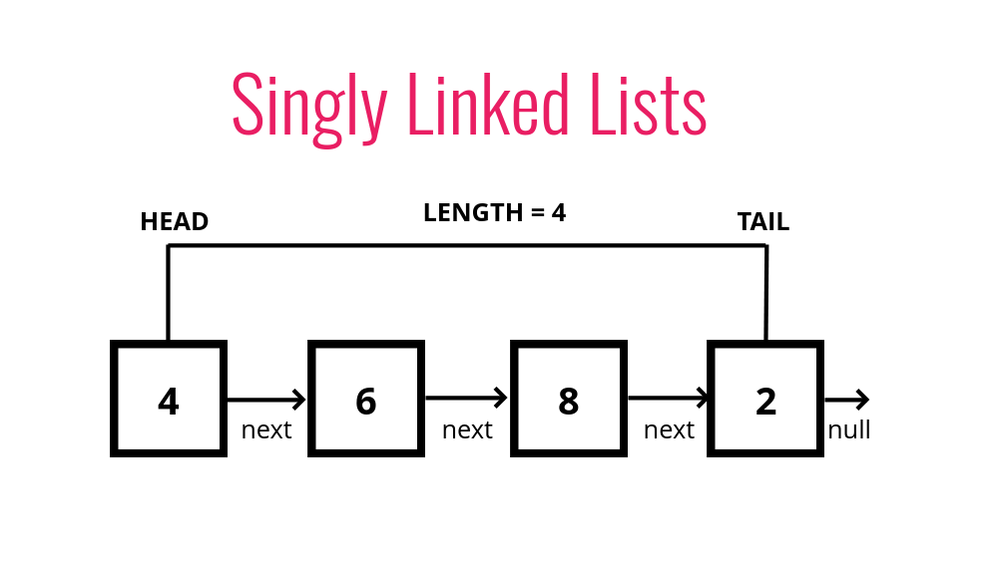

# JavaScript Algo and DSA

## Section 1: Big O Notation

### Lecture 1:

so to classify our programs as great, pretty good, just ok, ehhh, awful in more mathematical way then we use Big-O Notation

### Lecture 2:

sum of numbers upto n in different ways:

```
function addUpTo(n){
    let total = 0
    for(let i=0 ; i<=n; i++){
        total += i
    }
    return total
}
```

```
function addUpToN(n) {
    return n * (n + 1) /2
}
```

so one way to measure time taken by both these numbers is to use timers like this:

```
let t1 = performance.now()
addUpTo(1000000000)
let t2 = performance.now()
console.log(`time elapsed ${(t2-t1)/1000} seconds`)

for first its 1.25 sec
for second its 0 sec (not really)
```

But time depends on machine and even on same machine this method can give different readings so we needed something more standard to measure efficiency and thats why we use Big-O.

### Lecture 3:

Instead of time we calculate number of simple operations which processor would do to finish a function. Like algorithimic, assignment operations etc.

```
for first implementation : 5n + 2 operations
for second implementation : 2 operations
```

### Lecture 5:

Big-O is denoted as O(n) similarly to f(n), and since its calculated for upper bound i.e., worst case scenario of the algorithm. n means size of input.

- O(n) - linear
- O(n<sup>2</sup>) - quadratic
- O(1) - constant (independent of size of input)
- or could be something totally different

```
function countUpAndDown(n){
    console.log('going up');
    for(let i =0; i<n; i++){
        console.log(i);
    }
    console.log('at the top!\ngoing down');
    for(let i=n-1; i>0; i--){
        console.log(i);
    }
    console.log('Back down! Bye.')
}
```

> so since this function has two loops and one loop has time complexity of O(n) then entire function has O(n).

```
function printAllPairs(n){
    for(let i=0;i <=n; i++){
        for(let j=0; j<=n; j++){
            console.log(i,j)
        }
    }
}
```

> this function has O(n) operations inside O(n) operation hence its O(n^2^)

### Lecture 6:

_smaller numbers doesn't matter._ These big-O calculation are generally calculated for huge numbers of input so constants and smaller digits doesnt matter. for e.g:

- O(n<sup>2</sup> + 3n + 2 ) -> tail is redundant -> O(n<sup>2</sup>)

some shorthands are:

- arithemtic operations are constant.
- variable assignment is constant.
- accesing elements in an array(by index) or an object(by key) is also constant.
- In a loop, the complexity is the length of the loop times the complexity of whatever happens inside the loop.

Time complexity plot:


### Lecture 7:

Space complexity: measure of how much space an alogrithm needs to run. _Auxiliary Space Time Complexity_ is referred as space required by algorithm to run not to store the input data. Generally both the above terms are same.

some shorthands are:

- primitives take constant spaces O(1)
- Strings require O(n) space because its collection of characters.
- Reference types are generally O(n) where n is length of array or number of keys in an object.

```
function sum(arr){
    let total = 0;
    for(let i =0; i<arr.length; i++){
        total += i;
    }
    return total
}
```

In this example, total and i are only space taken by algo that means it has O(1) space complexity

```
function double(arr){
    let newArr = [];
    for(let i =0; i<arr.length; i++){
        newArr = newArr.push(2 * arr[i])
    }
    return total
}
```

this function has O(n) space complexity

### Lecture 8:

Logarithmic time complexity O(log(n)). searching algos, efficient sorting algos and recursion involves logarithmic space complexity

## Section 2: Analyzing Performance of arrays and objects

### Lecture 9:

Big-O of Objects: (its quick)

- Insertion - O(1)
- Removal - O(1)
- Searching - O(N)
- Access - O(1)

Big O of Object Methods:

- Object.keys - O(N)
- Object.values - O(N)
- Object.entries - O(N)
- hasOwnProperty - O(1)

### Lecture 10:

WHEN TO USE ARRAYS

- When you need order
- When you need fast access / insertion and removal (sort of....)

Big O of Arrays:-

- Insertion - It depends....
- Removal - It depends....
- Searching - O(N)
- Access - O(1)

> Insertion and removal at end is O(1) but from beginning its O(n) because of reassignment done by processor to make the indexes correct after insertion or removal.

### Lecture 11:

Big O of Array Operations:-

- push - O(1)
- pop - O(1)
- shift - O(N)
- unshift - O(N)
- concat - O(N)
- slice - O(N)
- splice - O(N)
- sort - O(N \* log N)
- forEach/map/filter/reduce/etc. - O(N)

## Section 3: Problem solving approach

### Lecture 12:

> WHAT IS AN ALGORITHM?

A process or set of steps to accomplish a certain task.

> Why do I need to know this?

Almost everything that you do in programming involves some kind of algorithm!
It's the foundation for being a successful problem solving and developer

Also... _*INTERVIEWS*_

> PROBLEM SOLVING

- Understand the Problem
- Explore Concrete Examples
- Break It Down
- Solve/Simplify
- Look Back and Refactor

### Lecture 13:

> UNDERSTAND THE PROBLEM

1. Can I restate the problem in my own words?
2. What are the inputs that go into the problem?
3. What are the outputs that should come from the solution to the problem?
4. Can the outputs be determined from the inputs? In other words, do I have enough information to solve the problem? (You may not be able to answer this question until you set about solving the problem. That's okay; it's still worth considering the question at this early stage.)
5. How should I label the important pieces of data that are a part of the problem?

> e.g: write a function which takes numbers as input and returns their sum

1. Can I restate the problem in my own words?

- implement addition

2. What are the inputs that go into the problem?

- int? float? String?
- how many inputs ?
- what if user doesn't pass an input?

3. What are the outputs that should come from the solution to the problem?

- int? float? string?
- with what precision?

and so on other questions need to be answered before starting to actually write the solution

### Lecture 14:

> Explore concrete examples

1. Start with Simple Examples
2. Progress to More Complex Examples
3. Explore Examples with Empty Inputs
4. Explore Examples with Invalid Inputs

> for e.g: Write a function which takes in a string and returns counts of each character in the string.

lets say charCount(str) is our function, then

- charCount("aaaa") // {a:4} or {a:4, b:0, ...}
- charCount("hello") // {h:1, e:1, l:2, o:1}
- "my phone number is 23423532" // what about spaces, numbers special characters?
- "Hello hi" // what about casing
- what about invalid inputs like integer, boolean, undefined or objects.
- what about no inputs

### Lecture 15:

> Break it down

for e.g: Write a function which takes in a string and returns counts of each character in the string.

after we have gone through all the required inputs and output criteria we can start with something like this

```
function charCount(str){
    // make object to return at the end.
    // loop over all the characters (str to lowercase)
        //if the char is a number/letter then only proceed
            // if char exist in object increase the count
            // else add the char in object with value 1
    // return the object
}
```

then we can solve the solution something like this:

```
function charCount(str){
    let countObj = {}
    str.toLowerCase().split("").forEach((ch) => {
        if ((ch >='0' && ch<='9') || (typeof ch.trim() == 'string' && ch.trim() !== '')){
            if(countObj.hasOwnProperty(ch)){
                countObj[ch] += 1
            }else{
                countObj[ch] =1
            }
        }
    })
    return countObj
}
```

### Lecture 16:

> solve/simplify

just start solving the problem with whatever part you can resolve first, build the structure and then try some cases which you expected to pass. Then solve the stuck part with a little bit of more brainstorming.

- Find the core difficulty in what you're trying to do
- Temporarily ignore that difficulty
- Write a simplified solution
- Then incorporate that difficulty back in

### Lecture 17:

> LOOK Back & REFACTOR

REFACTORING QUESTIONS:

- Can you check the result?
- Can you derive the result differently?
- Can you understand it at a glance?
- Can you use the result or method for some other problem?
- Can you improve the performance of your solution?
- Can you think of other ways to refactor?
- How have other people solved this problem?

so for e.g, after refactoring we have an efficient way for that if condition:

```
// if ((ch >='0' && ch<='9') || (typeof ch.trim() == 'string' && ch.trim() !== ''))

if(/[a-z0-9]/.test(ch))
```

this will test for numbers and strings and exclude special characters and spaces.

further optimizations led to

```
function charCount(str){
    let countObj = {}
    for(let ch of str){
        if(isAlphaNumeric(ch)){
            ch = ch.toLowerCase()
            countObj[ch] = ++countObj[ch] || 1
        }
    }
    return countObj
}

function isAlphaNumeric(char){
    let code = char.charCodeAt(0)
    if(!(code > 47 && code < 58) &&
       !(code > 64 && code < 91) &&
       !(code > 96 && code < 123)){
        return false;
    }
    return true
}

charCount("Hello hi!!")

output: {h: 2, e: 1, l: 2, o: 1, i: 1}
```

## Section 4: Problem solving patterns

### Lecture 18: Intro to problem solving patterns

SOME PATTERNS...

    Frequency Counter
    Multiple Pointers
    Sliding Window
    Divide and Conquer
    Dynamic Programming
    Greedy Algorithms
    Backtracking
    Many more!

### Lecture 19: Frequency counter pattern

This pattern uses objects or sets to collect values/frequencies of values

This can often avoid the need for nested loops or O(N^2) operations with arrays / strings

AN EXAMPLE

Write a function called same, which accepts two arrays. The function should return true if every value in the array has it's corresponding value squared in the second array. The frequency of values must be the same.

    same([1,2,3], [4,1,9]) // true
    same([1,2,3], [1,9]) // false
    same([1,2,1], [4,4,1]) // false (must be same frequency)

Naive approach - O(n\*\*2):

```
function same(arr1, arr2){
    if(arr1.length !== arr2.length)
        return false

    for(let num of arr1){
        correctIndex = arr2.indexOf(num**2)
        if(correctIndex === -1)
            return false
        arr2.splice(correctIndex,1)
        console.log(arr2)
    }
    return true
}

same([1,2,3,5], [1,4,4,9])
```

Refactored solution - O(n): make objects and store frequency of contents in array then compare it.

```
function same(arr1, arr2){
    if(arr1.length !== arr2.length)
        return false

    let frequencyCounter1 = {}
    let frequencyCounter2 = {}

    arr1.forEach((num) => {
        frequencyCounter1[num] = (frequencyCounter1[num] || 0) + 1
    })

    arr2.forEach((num) => {
        frequencyCounter2[num] = (frequencyCounter2[num] || 0) + 1
    })

    arr1.forEach((num) => {
        if(frequencyCounter1[num] !== frequencyCounter2[num**2]
           || !(num ** 2 in frequencyCounter2))
            return false
    })

    return true
}

same([1,2,3,2], [1,4,4,4])
```

### Lecture 20: Anagrams

Given two strings, write a function to determine if the second string is an anagram of the first. An anagram is a word, phrase, or name formed by rearranging the letters of another, such as cinema, formed from iceman

```
function validAnagram(str1, str2){
    if(str1.length !== str2.length)
        return false

    let freqCounter1 = {}
    let freqCounter2 = {}

    for(let ch of str1)
        freqCounter1[ch] = (freqCounter1[ch] || 0) + 1

    for(let ch of str2)
        freqCounter2[ch] = (freqCounter2[ch] || 0) + 1

    for(let key in freqCounter1){
        if(freqCounter1[key] !== freqCounter2[key])
            return false
    }
    return true
}

validAnagram('', '') // true
validAnagram('aaz', 'zza') // false
validAnagram('anagram', 'nagaram') // true
validAnagram("rat","car") // false) // false
validAnagram('awesome', 'awesom') // false
validAnagram('qwerty', 'qeywrt') // true
validAnagram('texttwisttime', 'timetwisttext') // true
```

a more optimized solution using just one object

```
function validAnagram(str1, str2){
    if(str1.length !== str2.length)
        return false

    let lookup = {}
    for(let ch of str2)
        lookup[ch] = (lookup[ch] || 0) + 1

    for(let ch of str1){
        if(!(ch in lookup))
            return false
        lookup[ch]-=1
    }

    return true
}
```

### Lecture 21: Multiple pointers

Creating pointers or values that correspond to an index or position and move towards the beginning, end or middle based on a certain condition

Very efficient for solving problems with minimal space complexity as well

for eg: Write a function called sumZero which accepts a sorted array of integers. The function should find the first pair where the sum is 0. Return an array that includes both values that sum to zero or undefined if a pair does not exist

naive solution:

```
function sumZero(arr){
    for(let i=0; i<arr.length; i++){
        for(let j= i+1; j<arr.length; j++){
            if(arr[i]+arr[j] === 0){
                return [arr[i], arr[j]]
            }
        }
    }
}

sumZero([-3,-2,-1,0,2,3,4])
```

refactored solution:

```
function sumZero(arr) {
    let left = 0
    let right = arr.length - 1
    while (left<right) {
        sum = arr[left] + arr[right]
        if(sum === 0)
            return [arr[left], arr[right]]
        sum > 0 ? right-- : left++
    }
}

sumZero([-3,-2,-1,0,4])
```

### Lecture 22-23: Count Unique values problem

Implement a function called countUniqueValues, which accepts a sorted array, and counts the unique values in the array. There can be negative numbers in the array, but it will always be sorted.

first approach when input arr can be modified:

```
function countUniqueValues(arr) {
    if(arr.length === 0)
        return 0
    let i = 0
    let j = 1
    while(j < arr.length){
        if(arr[i] !== arr[j]){
            i+=1
            arr[i] = arr[j]
        }
        j += 1
    }
    return i+1
}

countUniqueValues([1,2,3,4,4,4,7,7,12,12,13]) //7
```

second approach when input arr can't be modified.

```
function countUniqueValues2(arr) {
    if(arr.length === 0)
        return 0
    let i = 0
    let j = 1
    let uniqueValues = 0
    while(j < arr.length){
        if(arr[i] !== arr[j]){
            uniqueValues+=1
            i = j
        }
        j += 1
    }
    return uniqueValues
}
```

### Lecture 24: SLIDING WINDOW

This pattern involves creating a window which can either be an array or number from one position to another

Depending on a certain condition, the window either increases or closes (and a new window is created)

Very useful for keeping track of a subset of data in an array/string etc.

example:
Write a function called maxSubarraySum which accepts an array of integers and a number called n. The function should calculate the maximum sum of n consecutive elements in the array.

naive approach - O(n\*\*2)

```
function maxSubarraySum(arr,num) {
    if(arr.length === 0)
        return null
    let maxSum = -Infinity
    for(let i=0 ; i < arr.length; i++){
        tempMax = 0
        for(let j=0 ;j < num; j++){
            tempMax += arr[i+j]
        }
        if(tempMax>maxSum)
            maxSum = tempMax
    }

    return maxSum
}

maxSubarraySum([1,2,5,2,8,1,5],4)
```

optimized approach - sliding window - O(n)

```
function maxSubarraySum(arr,num) {
    if(arr.length === 0)
        return null
    let tempMax = 0;
    for(let i = 0; i<num; i++)
        tempMax += arr[i]
    let maxSum = tempMax
    for(let j= num; j< arr.length; j++){
        tempMax = tempMax + arr[j] - arr[j-num]
        maxSum = Math.max(tempMax, maxSum)
    }
    return maxSum
}

maxSubarraySum([1,2,5,2,8,1,5],4)
```

## Section 5: Challenges

### challenge 1:

Frequency Counter - sameFrequency

Write a function called sameFrequency. Given two positive integers, find out if the two numbers have the same frequency of digits.

Your solution MUST have the following complexities:

Time: O(N)

Sample Input:

    sameFrequency(182,281) // true
    sameFrequency(34,14) // false
    sameFrequency(3589578, 5879385) // true
    sameFrequency(22,222) // false

```
function sameFrequency(num1, num2) {
    let arr1 = String(num1).split('')
    let arr2 = String(num2).split('')

    if(arr1.length !== arr2.length)
        return false

    // make a lookup counter
    let lookupCounter = {}
    for(let x of arr2)
        lookupCounter[x] = (lookupCounter[x] || 0) + 1

    for(let x of arr1){
        // compare if x in lookup counter, if not return false
        if(!(x in lookupCounter))
            return false
        //reduce count in lookup
        lookupCounter[x] -=1
    }

    return true

}
```

### challenge 2:

Frequency Counter / Multiple Pointers - areThereDuplicates

Implement a function called, areThereDuplicates which accepts a variable number of arguments, and checks whether there are any duplicates among the arguments passed in. You can solve this using the frequency counter pattern OR the multiple pointers pattern.

Examples:

    areThereDuplicates(1, 2, 3) // false
    areThereDuplicates(1, 2, 2) // true
    areThereDuplicates('a', 'b', 'c', 'a') // true

Restrictions:  
Time - O(n)  
Space - O(n)  
Bonus:  
Time - O(n log n)  
Space - O(1)

- frequency counter solution

```
function areThereDuplicates(...args) {
    if(args.length === 0 || args.length === 1)
        return false

    let map = new Map()
    for (let x of args) {
        if(map.has(x))
            return true
        map.set(x,(map.get(x) || 0) + 1)
    }

    return false
}
```

- multiple pointers solution (requires sort)

```
function areThereDuplicates(...args) {
    if(args.length === 0 || args.length === 1)
        return false

    args.sort((a,b) => {
        if(a>b) return 1
        if(a<b) return -1
        return 0
    })

    let start = 0
    let next = 1
    while (next<args.length) {
        if(args[start] === args[next])
            return true
        start++
        next++
    }
    return false
}
```

- oneliner using Set

```
function oneLiner(...args){
    return new Set(args).size !== args.length
}
```

### leetcode - removeDuplicates

[Remove Duplicates](https://leetcode.com/problems/remove-duplicates-from-sorted-array/description/)

```
/**
 * @param {number[]} nums
 * @return {number}
 */
var removeDuplicates = function(nums) {
    if(nums.length === 0)
        return 0
    if(nums.length === 1)
        return 1
    let start = 0;
    let next = 1;
    while(next < nums.length){
        // check if value at start != next
        if(nums[start] !== nums[next]){
            // increase start by 1
            start += 1
            // move value at next to start
            nums[start] = nums[next]
        }
        // increase the next pointer
        next++;
    }
    return new Set(nums).size
};

```

### leetcode - removeElement

[Remove element](https://leetcode.com/problems/remove-element/description/)

```
/**
 * @param {number[]} nums
 * @param {number} val
 * @return {number}
 */
var removeElement = function(nums, val) {
    if(nums.length === 0){
        return 0
    }

    let lookup = 0;
    while(lookup < nums.length){
        // check if value at lookup equals val
        if(nums[lookup] === val){
            nums.splice(lookup,1)
        }else{
            // increment lookup
            lookup++;
        }
    }
    return nums.length
};
```

### challenge 3:

Write a function called averagePair. Given a sorted array of integers and a target average, determine if there is a pair of values in the array where the average of the pair equals the target average. There may be more than one pair that matches the average target.

Bonus Constraints:

Time: O(N)

Space: O(1)

Sample Input:

    averagePair([1,2,3],2.5) // true
    averagePair([1,3,3,5,6,7,10,12,19],8) // true
    averagePair([-1,0,3,4,5,6], 4.1) // false
    averagePair([],4) // false

optimized solution

```
function averagePair(arr, avg){
    if(arr.length === 0)
        return false

    let start = 0
    let map = new Map()
    while (start < arr.length) {
        //calculate difference between twice the avg and number at start
        let diff = 2 * avg - arr[start]
        //check if number at start exists in map
        if(map.has(diff)){
            // if it does then return true
            return true
        }
        // if it doesn't then increase start and add the
        // difference as key and index as value in map
        map.set(arr[start], start)
        start++
    }
    return false
}
```

### challenge 4 : Multiple Pointers - isSubsequence

Write a function called isSubsequence which takes in two strings and checks whether the characters in the first string form a subsequence of the characters in the second string. In other words, the function should check whether the characters in the first string appear somewhere in the second string, without their order changing.

Examples:

    isSubsequence('hello', 'hello world'); // true
    isSubsequence('sing', 'sting'); // true
    isSubsequence('abc', 'abracadabra'); // true
    isSubsequence('abc', 'acb'); // false (order matters)

Your solution MUST have AT LEAST the following complexities:

Time Complexity - O(N + M)

Space Complexity - O(1)

O(N2) approach

```
function isSubsequence(str1, str2) {
    // good luck. Add any arguments you deem necessary.
    if(!(str1 || str2))
        return false

    let s = 0
    str1 = str1.split("")
    while (s < str2.length) {
        //check if ch at s in str2 exist in str1 and also
        //equal to character at 0 in str1
        if(str1[0] === str2[s]){
            // if true then splice the str1 by 1
            str1.splice(0,1)
        }
        // increase s by 1
        s++
    }

    //return true if str1 has 0 length or return false
    return str1.length ? false : true
}
```

O(N+M) approach

```
function isSubsequence(str1, str2) {
    // good luck. Add any arguments you deem necessary.
    if(!(str1 || str2))
        return false

    let s = 0
    let t = 0
    str1 = str1.split("")
    while (s < str2.length) {
        //check if value at s in str2 equals value at t in str1
        if(str1[t] === str2[s])
            t++
        //check if t equals str1.length then return true
        if(str1.length == t)
            return true
        // increase s by 1
        s++
    }

    //return true if str1 has 0 length or return false
    return false
}

isSubsequence('abc', 'acb');
```

### challenge 5: Sliding Window - maxSubarraySum

Given an array of integers and a number, write a function called maxSubarraySum, which finds the maximum sum of a subarray with the length of the number passed to the function.

Note that a subarray must consist of consecutive elements from the original array. In the first example below, [100, 200, 300] is a subarray of the original array, but [100, 300] is not.

    maxSubarraySum([100,200,300,400], 2) // 700
    maxSubarraySum([1,4,2,10,23,3,1,0,20], 4)  // 39
    maxSubarraySum([-3,4,0,-2,6,-1], 2) // 5
    maxSubarraySum([3,-2,7,-4,1,-1,4,-2,1],2) // 5
    maxSubarraySum([2,3], 3) // null

Constraints:

Time Complexity - O(N)

Space Complexity - O(1)

```
function maxSubarraySum(arr, num){
    // add whatever parameters you deem necessary - good luck!
    if(arr.length < num || arr.length === 0){
        return null
    }

    let max = 0
    for(let i =0 ;i<num; i++){
        max += arr[i]
    }

    let tempMax = max
    for(let j = num;j <arr.length; j++){
        tempMax = tempMax + arr[j] - arr[j-num]
        // check if tempMax > max
        if(tempMax > max){
            // if true then assign tempMax to max
            max = tempMax
        }
    }

    return max
}
```

### challenge 6: Sliding Window - minSubArrayLen

Write a function called minSubArrayLen which accepts two parameters - an array of positive integers and a positive integer.

This function should return the minimal length of a contiguous subarray of which the sum is greater than or equal to the integer passed to the function. If there isn't one, return 0 instead.
Examples:

    minSubArrayLen([2,3,1,2,4,3], 7) // 2 -> because [4,3] is the smallest subarray
    minSubArrayLen([2,1,6,5,4], 9) // 2 -> because [5,4] is the smallest subarray
    minSubArrayLen([3,1,7,11,2,9,8,21,62,33,19], 52) // 1 -> because [62] is greater than 52
    minSubArrayLen([1,4,16,22,5,7,8,9,10],39) // 3
    minSubArrayLen([1,4,16,22,5,7,8,9,10],55) // 5
    minSubArrayLen([4, 3, 3, 8, 1, 2, 3], 11) // 2
    minSubArrayLen([1,4,16,22,5,7,8,9,10],95) // 0

Time Complexity - O(n)

Space Complexity - O(1)

```
function minSubArrayLen(arr, sum) {
  let start = 0;
  let end = 0;
  let total = 0;
  let minLen = Infinity

  while (start < arr.length) {
    if (total < sum && end < arr.length) {
      total += arr[end];
      end++;
    } else if (total >= sum) {
      minLen = Math.min(minLen, end - start);
      total -= arr[start]
      start += 1;
    } else {
      break;
    }
  }
  console.log(minLen);
  return minLen === Infinity ? 0 : minLen;
}
```

### challenge 7: Sliding Window - findLongestSubstring

Write a function called findLongestSubstring, which accepts a string and returns the length of the longest substring with all distinct characters.

    findLongestSubstring('') // 0
    findLongestSubstring('rithmschool') // 7
    findLongestSubstring('thisisawesome') // 6
    findLongestSubstring('thecatinthehat') // 7
    findLongestSubstring('bbbbbb') // 1
    findLongestSubstring('longestsubstring') // 8
    findLongestSubstring('thisishowwedoit') // 6

Time Complexity - O(n)

```
function findLongestSubstring(str) {
      let longest = 0;
      let seen = {};
      let start = 0;

      for (let i = 0; i < str.length; i++) {
        let char = str[i];
        if (seen[char]) {
          start = Math.max(start, seen[char]);
        }
        // index - beginning of substring + 1 (to include current in count)
        longest = Math.max(longest, i - start + 1);
        // store the index of the next char so as to not double count
        seen[char] = i + 1;
      }
      return longest;
    }
```

## Section 6: Recursion

### Lecture 25: What is recursion?

A process (a function in our case) that calls itself

### Lecture 26: Why is recursion?

It's EVERYWHERE!

- JSON.parse / JSON.stringify
- document.getElementById and DOM traversal algorithms
- Object traversal
- Very common with more complex algorithms
- It's sometimes a cleaner alternative to iteration

### Lecture 27: The call stack

when a function is called inside another function its placed on top of calling function in call stack. In case of recursion, since a function is calling itself than its keep getting stacked in call stack. So we need some conditions to return and exit function i.e called base condition.

### Lecture 28: How recursive functions work

Invoke the same function with a different input until you reach your base case!, basically ending the call stack with some conditions

Base Case: The condition when the recursion ends.
Two essential parts of a recursive function!:

- Base Case
- Different Input

e.g:

```
function countDown(num){
    if(num <= 0) {
        console.log("All done!");
        return;
    }
    console.log(num);
    num--;
    countDown(num);
}
```

### Lecture 29: Helper method recursion:

Its a pattern of recursive way of doing things. A helper function is defined inside a function and called recursively and alter the values of outside scope.

```
function outer(input){
    var outerScopedVariable = []

    function helper(helperInput){
        // modify the outerScopedVariable
        helper(helperInput--)
    }

    helper(input)
    return outerScopedVariable;
}
```

lets take an example of collecting odd numbers from an array recursively

```
function collectOddValues(arr){

    let result = []

    function helper(helperInput){
        // base condition
        if(helperInput.length === 0) {
            return;
        }

        if(helperInput[0] % 2 !== 0){
            result.push(helperInput[0])
        }

        // it is called with smaller input each time
        helper(helperInput.slice(1))
    }
    helper(arr)
    return result;
}
```

or factorial recursively using helper

```
function factorial(params) {
    let result = 1

    function helper(helperInput) {
        if(helperInput === 0)
            return 1

        result *= helperInput
        helper(helperInput-1)
    }

    helper(params)
    return result
}
```

### Lecture 30: Pure Recursion
calling the same method inside another method in a way that the result is returned from the first array itself. e.g:

```
function collectOddValues(arr){
    let newArr = [];
    
    if(arr.length === 0) {
        return newArr;
    }
        
    if(arr[0] % 2 !== 0){
        newArr.push(arr[0]);
    }
        
    newArr = newArr.concat(collectOddValues(arr.slice(1)));
    return newArr;
}
```

Pure Recursion Tips

- For arrays, use methods like slice, the spread operator, and concat that make copies of arrays so you do not mutate them
- Remember that strings are immutable so you will need to use methods like slice, substr, or substring to make copies of strings
- To make copies of objects use Object.assign, or the spread operator

### leetcode - plusOne

[plus one](https://leetcode.com/problems/plus-one/)
```
/**
 * @param {number[]} digits
 * @return {number[]}
 */
var plusOne = function(digits) {
    if(digits.length===0){
        return []
    }

    let end = digits.length-1
    let lastValue = digits[end] + 1
    while(end>-1){
        if(lastValue<10){
            digits[end] = lastValue
            break
        }
        let rem = lastValue % 10
        let quot = Math.floor(lastValue / 10)
        if(end===0){
            digits[0] = rem
            digits.unshift(quot)
            return digits
        }
        digits[end] = rem
        end--
        digits[end] += quot
        lastValue = digits[end]
    }
    return digits
};
```
### leetcode - searchRange
[search range](https://leetcode.com/problems/find-first-and-last-position-of-element-in-sorted-array/description/)

```
/**
 * @param {number[]} nums
 * @param {number} target
 * @return {number[]}
 */
var searchRange = function(nums, target) {
    // it will be faster with binary sort but this is more iterative approach 
    if(nums.length===0 || !nums.includes(target)){
        return [-1,-1]
    }

    let result = []
    let start = 0
    while(start<nums.length){
        if(nums[start] === target){
            result.push(start)
        }
        start++
    }

    return [result[0], result[result.length-1]]
};
```

### leetcode - group anagrams
[group anagrams](https://leetcode.com/problems/group-anagrams/description/)

```
var groupAnagrams = function(strs) {
    let map = new Map()
    for(let str of strs){
        let sorted = str.split("").sort().join("")
        if(map.has(sorted)){
            map.set(sorted,[...map.get(sorted), str])
        }else{
            map.set(sorted,[str])
        }
    }
    return Array.from(map.values())
}
```
### leetcode - group anagrams
[Find All Anagrams in a String](https://leetcode.com/problems/find-all-anagrams-in-a-string/description/)
```
/**
 * @param {string} s
 * @param {string} p
 * @return {number[]}
 */
var findAnagrams = function(s, p) {

    let lookup = {}
    let result = []
    for(let ch of p){
        lookup[ch] = (lookup[ch] || 0) + 1
    }

    let l = 0
    let r = 0
    while(r<s.length){
        let ch = s[r]
        if(lookup[ch]>0){
            lookup[ch]--;
            if(r-l + 1 === p.length) result.push(l)
            r++;
        }else {
            if(lookup[s[l]] !== undefined) lookup[s[l]]++
            l++
            if(l>r) r = l            
        }
    }
    return result
};
```

### leetcode - 3Sum
[three sum](https://leetcode.com/problems/3sum/)

```
/**
 * @param {number[]} nums
 * @return {number[][]}
 */
var threeSum = function(nums) {
    let result = []
    let i = 0
    let j = 1
    let k = j+1
    while(j<nums.length){
        if(nums[i] + nums[j] + nums[k] === 0){
            let arr = [nums[i],nums[j], nums[k]]
            if(!result.sort().join(',').includes(arr.sort().join(',')))
                result.push(arr)
            j++
            k = j+1
        }else{
            k++
            if(k>nums.length){
                j++
                k = j+1
            }
        }
    }

    return result
};
```

### leetcode - power of two

[power of two](https://leetcode.com/problems/power-of-two/)

```
/**
 * @param {number} n
 * @return {boolean}
 */
var isPowerOfTwo = function(n) {

    // bitwise manipulation,
    // 2(10) 4(100) 8(1000),  6(110)
    return n > 0 ? !(n & (n-1)) : false

    // recursive approach (faster, still can be improved):
    if(n===1)
        return true
    
    if(n%2!==0 || n===0)
        return false

    return isPowerOfTwo(n/2)

    // works but less optimized
    // while(n>1){
    //     n=n/2
    // }

    // return n===1 ? true : false
};
```

## Recursion problems:

### Reverse a string

Write a recursive function called reverse which accepts a string and returns a new string in reverse.

```
function reverse(str){
    let result = ''
    let index = str.length-1
    
    if(index===0)
        return str[index]
        
    result = str[index] + reverse(str.substr(0, index))
    return result
}

// reverse('awesome') // 'emosewa'
// reverse('rithmschool') // 'loohcsmhtir'
```

### isPalindrome

Write a recursive function called isPalindrome which returns true if the string passed to it is a palindrome (reads the same forward and backward). Otherwise it returns false.

```
function isPalindrome(str){
    if(str.length<=1) return true
    if(str[0] === str[str.length-1]) return isPalindrome(str.slice(1,-1))
    return false;
}
```

### someRecursive

Write a recursive function called someRecursive which accepts an array and a callback. The function returns true if a single value in the array returns true when passed to the callback. Otherwise it returns false.

```
// SAMPLE INPUT / OUTPUT
// const isOdd = val => val % 2 !== 0;

// someRecursive([1,2,3,4], isOdd) // true
// someRecursive([4,6,8,9], isOdd) // true
// someRecursive([4,6,8], isOdd) // false
// someRecursive([4,6,8], val => val > 10); // false

function someRecursive(arr, callback){
    if(arr.length===0) return false
    if(callback(arr[0])) return true
    return someRecursive(arr.slice(1), callback)
}
```

### flatten
Write a recursive function called flatten which accepts an array of arrays and returns a new array with all values flattened.

```
function flatten(arr){
    let result = []
    
    for(let i=0; i<arr.length; i++){
        if(Array.isArray(arr[i]))
            result = result.concat(flatten(arr[i]))
        else
            result.push(arr[i])
    }
    
    return result
}

// flatten([1, 2, 3, [4, 5] ]) // [1, 2, 3, 4, 5]
// flatten([1, [2, [3, 4], [[5]]]]) // [1, 2, 3, 4, 5]
// flatten([[1],[2],[3]]) // [1,2,3]
// flatten([[[[1], [[[2]]], [[[[[[[3]]]]]]]]]]) // [1,2,3]
```

### capitalizeFirst

Write a recursive function called capitalizeFirst. Given an array of strings, capitalize the first letter of each string in the array.

```
function capitalizeFirst (arr) {
    let result = []
    if(arr.length === 0) return []
    result = result.concat(arr[0][0].toUpperCase() + arr[0].substring(1)).concat(capitalizeFirst(arr.slice(1)))
    return result
}

// capitalizeFirst(['car','taco','banana']); // ['Car','Taco','Banana']

```

### nestedEvenSum

Write a recursive function called nestedEvenSum. Return the sum of all even numbers in an object which may contain nested objects.

```
function nestedEvenSum (obj) {
    let result = 0
    
    for(let key in obj){
        if(typeof obj[key] === 'object')
            result += nestedEvenSum(obj[key])
        else
            result += obj[key] % 2 === 0 ? obj[key] : 0
    }
    
    return result
}


var obj1 = {
  outer: 2,
  obj: {
    inner: 2,
    otherObj: {
      superInner: 2,
      notANumber: true,
      alsoNotANumber: "yup"
    }
  }
}

var obj2 = {
  a: 2,
  b: {b: 2, bb: {b: 3, bb: {b: 2}}},
  c: {c: {c: 2}, cc: 'ball', ccc: 5},
  d: 1,
  e: {e: {e: 2}, ee: 'car'}
};

nestedEvenSum(obj1); // 6
nestedEvenSum(obj2); // 10
```

### capitalizeWords

Write a recursive function called capitalizeWords. Given an array of words, return a new array containing each word capitalized.

```
function capitalizeWords (arr) {
    let result = []
    if(arr.length === 0) return []
    result = result.concat(arr[0].toUpperCase()).concat(capitalizeWords(arr.slice(1)))
    return result
}

// let words = ['i', 'am', 'learning', 'recursion'];
// capitalizedWords(words); // ['I', 'AM', 'LEARNING', 'RECURSION']
```

### stringifyNumbers

Write a function called stringifyNumbers which takes in an object and finds all of the values which are numbers and converts them to strings. Recursion would be a great way to solve this!

```
function stringifyNumbers(obj) {
    let result = {}
    for(let key in obj){
        if(typeof obj[key] === 'object' && !Array.isArray(obj[key]))
            result[key] = stringifyNumbers(obj[key])
        else
            result[key] = typeof obj[key] === "number" ? obj[key].toString() : obj[key]
    }
    
    return result
}

/*
let obj = {
    num: 1,
    test: [],
    data: {
        val: 4,
        info: {
            isRight: true,
            random: 66
        }
    }
}
/*

stringifyNumbers(obj)

/*
{
    num: "1",
    test: [],
    data: {
        val: "4",
        info: {
            isRight: true,
            random: "66"
        }
    }
}
*/
```

### collectStrings

Write a function called collectStrings which accepts an object and returns an array of all the values in the object that have a typeof string

```
function collectStrings(obj){
    let result = []
    for(let key in obj){
        const val = obj[key]
        if(typeof val === 'object')
            result = result.concat(collectStrings(val))
        else
            result = result.concat(val)
    }
    
    return result
}

const obj = {
    stuff: "foo",
    data: {
        val: {
            thing: {
                info: "bar",
                moreInfo: {
                    evenMoreInfo: {
                        weMadeIt: "baz"
                    }
                }
            }
        }
    }
}

collectStrings(obj) // ["foo", "bar", "baz"])
```

## Section 7: Searching Algorithms

### Objectives:
1. Describe what a searching algorithm is
2. Implement linear search on arrays
3. Implement binary search on sorted arrays
4. Implement a naive string searching algorithm
5. Implement the KMP string searching algorithm

### Lecture 31: JavaScript has search!

There are many different search methods on arrays in JavaScript:

    indexOf
    includes
    find
    findIndex

But how do these functions work? "Linear search"

Pseudo code for *linear search*

- This function accepts an array and a value
- Loop through the array and check if the current array element is equal to the value
- If it is, return the index at which the element is found
- If the value is never found, return -1

### Lecture 32: Linear Search

Write a function called linearSearch which accepts an array and a value, and returns the index at which the value exists. If the value does not exist in the array, return -1.

Don't use indexOf to implement this function!

Examples:

    linearSearch([10, 15, 20, 25, 30], 15) // 1
    linearSearch([9, 8, 7, 6, 5, 4, 3, 2, 1, 0], 4) // 5
    linearSearch([100], 100) // 0
    linearSearch([1,2,3,4,5], 6) // -1
    linearSearch([9, 8, 7, 6, 5, 4, 3, 2, 1, 0], 10) // -1
    linearSearch([100], 200) // -1

```
function linearSearch(arr, value){
    for(let i=0; i<arr.length; i++){
        if(arr[i] === value)
            return i
    }
    
    return -1
}
```

BIG-O is O(1) best, O(n) is worst and average

### Lecture 33: Binary Search

-    Binary search is a much faster form of search
-    Rather than eliminating one element at a time, you can eliminate half of the remaining elements at a time
-    Binary search only works on sorted arrays!

pseudocode:
-    This function accepts a sorted array and a value
-    Create a left pointer at the start of the array, and a right pointer at the end of the array
-    While the left pointer comes before the right pointer:
     - Create a pointer in the middle
     - If you find the value you want, return the index
     - If the value is too small, move the left pointer up
     - If the value is too large, move the right pointer down
-    If you never find the value, return -1

```
function binarySearch(arr,val){
    let l = 0
    let r = arr.length - 1
    let m = Math.floor((l + r) / 2)
    while(l<=r){
        if(arr[m] === val)
            return m
        else if(arr[m] > val)
            r = m - 1
        else
            l = m + 1
        
        m = Math.floor((l + r) / 2)
    }
    
    return -1
}
```

- ### Big O of Binary Search

Worst and average case is O(log(n)), best case is O(1). It is because the number of operations performed is getting halved in every iteration.

### Lecture 34: Naive String Search

- Suppose you want to count the number of times a smaller string appears in a longer string
- A straightforward approach involves checking pairs of characters individually


Pseudocode

-    Loop over the longer string
-   Loop over the shorter string
-   If the characters don't match, break out of the inner loop
-    If the characters do match, keep going
-   If you complete the inner loop and find a match, increment the count of matches
-   Return the count

```
function naiveSearch(str, val){
    let result = 0
    let i = 0
    while(i<str.length){
        for(let j=0; j<val.length; j++){
            if(val[j] !== str[i+j]) break    
            if(j===val.length-1) result++
        }
        i++
    }
    return result
}

findPatternString("wozogomgzoomg", "omg")
```

### leetcode - search in sorted array

[search in sorted array](leetcode.com/problems/search-in-rotated-sorted-array/)

```
/**
 * @param {number[]} nums
 * @param {number} target
 * @return {number}
 */
var search = function(nums, target) {
    let l = 0
    let r = nums.length - 1

    while(l<=r){
        let m = Math.floor((l+r)/2)
        let nl = nums[l]
        let nm = nums[m]
        let nr = nums[r]

        if(nm === target) return m

        if(nl <= nm){
            if(nl <= target && target <= nm){
                r = m - 1
            }else{
                l = m + 1
            }
        }
        else{
            if(nm <= target && target <= nr){
                l = m + 1
            }else{
                r = m - 1
            }
        }
    }

    return -1
};
```

### leetcode - Successful Pairs of Spells and Potions

[Successful Pairs of Spells and Potions
](https://leetcode.com/problems/successful-pairs-of-spells-and-potions)

```
var successfulPairs = function(spells, potions, success) {
    let result = []
    potions =  potions.sort(function(a,b){return a-b})
    for(let i=0; i<spells.length; i++){
        let l = 0
        let r = potions.length-1
        while(l<=r){
            let m = Math.floor((l+r)/2)
            if(spells[i] * potions[m] < success){
                l = m+1
            }else{
                r = m-1
            }
        }
        result.push(potions.length-l)
    }

    return result
}
```

## section 8: Sorting algorithms

Objectives

-    Implement bubble sort
-    Implement selection sort
-    Implement insertion sort
-    Understand why it is important to learn these simpler sorting algorithms

### Lecture 35: What is sorting?

Sorting is the process of rearranging the items in a collection (e.g. an array) so that the items are in some kind of order.

Examples

- Sorting numbers from smallest to largest
- Sorting names alphabetically
- Sorting movies based on release year
- Sorting movies based on revenue

### Lecture 36: JavaScript has a sort method
but it doesn't always work as expected


Telling JavaScript how to sort

- The built-in sort method accepts an optional comparator function
- You can use this comparator function to tell JavaScript how you want it to sort
- The comparator looks at pairs of elements (a and b), determines their sort order based on the return value

  -    If it returns a negative number, a should come before b
  -    If it returns a positive number, a should come after b,
  -    If it returns 0, a and b are the same as far as the sort is concerned

### Lecture 37: Bubble Sort

BubbleSort Pseudocode

- Start looping from with a variable called i the end of the array towards the beginning
- Start an inner loop with a variable called j from the beginning until i - 1
- If arr[j] is greater than arr[j+1], swap those two values!
- Return the sorted array

```
function swap(arr,idx1,idx2){
    let temp = arr[idx1]
    arr[idx1] = arr[idx2]
    arr[idx2] = temp
}

function bubbleSort(arr){
    for(let i=arr.length - 1; i>=0; i--){
        for(let j= 0; j < i-1; j++){
            if(arr[j] > arr[j+1])
                swap(arr,j,j+1)
        }
    }
    
    return arr
}
```

In case of nearly sorted arrays we can optimize further

```
function bubbleSort(arr){
    let counter = 0
    let swapped;
    for(let i=arr.length - 1; i>=0; i--){
        swapped = false;
        for(let j= 0; j < i-1; j++){
            counter++
            if(arr[j] > arr[j+1]){
                swapped = true
                swap(arr,j,j+1)
            }
        }
        if(!swapped) break
    }
    console.log(counter)
    return arr
}
```

Generally time complexity of bubble sort is O(n2) but with nearly sorted data and noSwap optimization its nearly linear which is best case. But its still not the best choice for sorting unless we know our data is almost sorted.

### Lecture 38: Selection Sort

Similar to bubble sort, but instead of first placing large values into sorted position, it places small values into sorted position

```
[ 5, 3, 4, 1, 2 ]
[ 5, 3, 4, 1, 2 ]
[ 5, 3, 4, 1, 2 ]
[ 5, 3, 4, 1, 2 ]
[ 1, 3, 4, 5, 2 ]

1 is now in its sorted position!
```

Selection Sort Pseudocode

- Store the first element as the smallest value you've seen so far.
- Compare this item to the next item in the array until you find a smaller number.
- If a smaller number is found, designate that smaller number to be the new "minimum" and continue until the end of the array.
- If the "minimum" is not the value (index) you initially began with, swap the two values.
- Repeat this with the next element until the array is sorted.

MY SOLUTION:-

```
function swap(arr,idx1,idx2){
    let temp = arr[idx1]
    arr[idx1] = arr[idx2]
    arr[idx2] = temp
}

function selectionSort(arr){
    for(let i=0 ; i<arr.length; i++){
        let min = arr[i]
        let indexOfmin = i
        let newMin = min
        for(j=i+1;j<arr.length; j++){
            newMin = Math.min(newMin, arr[j])
            if(newMin === arr[j]){
                indexOfmin = j
            }
        }
        swap(arr, i, indexOfmin)
    }
    
    return arr
}

```

CLEANER VERSION : 
```
function swap(arr,idx1,idx2){
    let temp = arr[idx1]
    arr[idx1] = arr[idx2]
    arr[idx2] = temp
}

function selectionSort(arr){
    for(let i=0 ; i<arr.length; i++){
        let lowest = i
        for(j=i+1;j<arr.length; j++){
            if(arr[j]<arr[lowest])
                lowest = j
        }
        if(lowest !== i)
            swap(arr, i, lowest)
    }
    
    return arr
}
```

When input is pretty large then worst case time complexity of Selection sort is O(n2) even if the no. of swaps are decreasing everytime but it does't matter when input is huge.

### Lecture 39: Insertion Sort

Builds up the sort by gradually creating a larger left half which is always sorted

Insertion Sort Pseudocode

- Start by picking the second element in the array
- Now compare the second element with the one before it and swap if necessary.
- Continue to the next element and if it is in the incorrect order, iterate through the sorted portion (i.e. the left side) to place the element in the correct place.
- Repeat until the array is sorted.

cleaner version: 
```
function insertionSort(arr){
    for(let i=1 ;i<arr.length; i++){
        let currentVal = arr[i]
        for(var j=i-1; j>=0 && arr[j] > currentVal; j--){
            arr[j+1] = arr[j]
        }
        arr[j+1] = currentVal
    }
    return arr
}
```

In worst case scenario its O(n2) but if its almost all sorted then its much better than bubble and selection

### Big O of Sorting Algorithms

Algorithm 	Time Complexity (Best) 	Time Complexity (Average) 	Time Complexity (Worst) 	Space Complexity

```
Bubble Sort 	O(n) 	O(n) 	O(n) 	O(1)
Insertion Sort 	O(n) 	O(n) 	O(n) 	O(1)
Selection Sort 	O(n) 	O(n) 	O(n) 	O(1)
```

- Sorting is fundamental!
- Bubble sort, selection sort, and insertion sort are all roughly equivalent
- All have average time complexities that are quadratic
- We can do better...but we need more complex algorithms!

## Intermediate Sorting Algorithms

Objectives

- Understand the limitations of the sorting algorithms we've learned so far
- Implement merge sort
- Implement quick sort
- Implement radix sort

WHY LEARN THIS?

- The sorting algorithms we've learned so far don't scale well
- Try out bubble sort on an array of 100000 elements, it will take quite some time!
- We need to be able to sort large arrays more quickly

FASTER SORTS

- There is a family of sorting algorithms that can improve time complexity from O(n  ) to O(n log n)
- There's a tradeoff between efficiency and simplicity
- The more efficient algorithms are much less simple, and generally take longer to understand

### Lecture 40 : Merge Sort

- It's a combination of two things - merging and sorting!
- Exploits the fact that arrays of 0 or 1 element are always sorted
- Works by decomposing an array into smaller arrays of 0 or 1 elements, then building up a newly sorted array

```

How does it work?

Let's visualize this!

[ 8, 3, 5, 4, 7, 6, 1, 2 ]

[ 8, 3, 5, 4 ] [ 7, 6, 1, 2 ]

[ 8, 3 ] [ 5, 4 ] [ 1, 2 ] [ 7, 6 ]

[ 8 ] [ 3 ] [ 5 ] [ 4 ] [ 7 ] [ 6 ] [ 1 ] [ 2 ]

[ 3, 8 ] [ 4, 5 ] [ 6, 7 ] [ 1, 2 ] 

[ 3, 4, 5, 8 ] [ 1, 2, 6, 7 ]

[ 1, 2, 3, 4, 5, 6, 7, 8 ]

```

### Lecture 41: Merging Arrays

- In order to implement merge sort, it's useful to first implement a function responsible for merging two sorted arrays
- Given two arrays which are sorted, this helper function should create a new array which is also sorted, and consists of all of the elements in the two input arrays
- This function should run in O(n + m) time and O(n + m) space and should not modify the parameters passed to it.


Merging Arrays Pseudocode

- Create an empty array, take a look at the smallest values in each input array
- While there are still values we haven't looked at...

- If the value in the first array is smaller than the value in the second array, push the value in the first array into our results and move on to the next value in the first array
- If the value in the first array is larger than the value in the second array, push the value in the second array into our results and move on to the next value in the second array
- Once we exhaust one array, push in all remaining values from the other array

```
function mergeTwoArrays(arr1, arr2){
    let arr = []
    let i = 0
    let j = 0
    while(i<arr1.length && j<arr2.length){
        if(arr1[i] <= arr2[j]){
            arr.push(arr1[i])
            i++
        }else {
            arr.push(arr2[j])
            j++
        }
    }

    while(i<arr1.length){
        arr.push(arr1[i])
        i++
    }
    
    while(j<arr2.length){
        arr.push(arr2[j])
        j++
    }

    // spread operator will throw call stack exceeded for inputs length greater than 100M
    // i>j ? arr.push(...arr2.slice(j)) : arr.push(...arr1.slice(i))
    return arr
}

mergeTwoArrays([1,10,50], [1,2,14,99,100])
```

### Lecture 42: complete Merge sort

mergeSort Pseudocode

- Break up the array into halves until you have arrays that are empty or have one element
- Once you have smaller sorted arrays, merge those arrays with other sorted arrays until you are back at the full length of the array
- Once the array has been merged back together, return the merged (and sorted!) array

```
function mergeSort(arr){
    if (arr.length <= 1) return arr
    let N = Math.floor(arr.length/2)
    let left = mergeSort(arr.slice(0,N))
    let right = mergeSort(arr.slice(N))
    return mergeTwoArrays(left,right)
}
```

### Lecture 43: Big-O of mergeSort

Best - O(nlogn)
worst - O(nlogn)
average - O(nlogn)
Space complexity - O(n)

### Lecture 44: Quick Sort

- Like merge sort, exploits the fact that arrays of 0 or 1 element are always sorted
- Works by selecting one element (called the "pivot") and finding the index where the pivot should end up in the sorted array
- Once the pivot is positioned appropriately, quick sort can be applied on either side of the pivot

### Lecture 45: pivot helper

function responsible for returning pivot index which is the index where array is divided into left and right parts

- In order to implement merge sort, it's useful to first implement a function responsible arranging elements in an array on either side of a pivot
- Given an array, this helper function should designate an element as the pivot
- It should then rearrange elements in the array so that all values less than the pivot are moved to the left of the pivot, and all values greater than the pivot are moved to the right of the pivot
- The order of elements on either side of the pivot doesn't matter!
- The helper should do this in place, that is, it should not create a new array
- When complete, the helper should return the index of the pivot


Picking a pivot

- The runtime of quick sort depends in part on how one selects the pivot
- Ideally, the pivot should be chosen so that it's roughly the median value in the data set you're sorting
- For simplicity, we'll always choose the pivot to be the first element (we'll talk about consequences of this later)


Pivot Pseudocode

- It will help to accept three arguments: an array, a start index, and an end index (these can default to 0 and the array length minus 1, respectively)
- Grab the pivot from the start of the array 
- Store the current pivot index in a variable (this will keep track of where the pivot should end up)
- Loop through the array from the start until the end
  - If the pivot is greater than the current element, increment the pivot index variable and then swap the current element with the element at the pivot index
- Swap the starting element (i.e. the pivot) with the pivot index
- Return the pivot index

```
function pivot(arr, start=0, end=arr.length-1) {
    let swapIdx = start
    let pivot = arr[start]

    function swap(arr,idx1,idx2){
        let temp = arr[idx1]
        arr[idx1] = arr[idx2]
        arr[idx2] = temp
    }

    for(let i=start + 1; i<=end; i++){
        if(pivot > arr[i]){
            swapIdx++
            swap(arr,i,swapIdx)
            console.log(arr, swapIdx)
        }
    }

    swap(arr, swapIdx, start)
    return swapIdx
}
```

### Lecture 46: Quicksort Pseudocode

- Call the pivot helper on the array
- When the helper returns to you the updated pivot index, recursively call the pivot helper on the subarray to the left of that index, and the subarray to the right of that index
- Your base case occurs when you consider a subarray with less than 2 elements

```
function quickSort(arr, left=0, right=arr.length-1) {
    if(left < right) {
        let pivotIndex = pivot(arr,left,right)
        quickSort(arr, left, pivotIndex-1)
        quickSort(arr, pivotIndex+1, right)
    }
    return arr
}
```

### Lecture 47: Big-O of quicksort

Best case - O(nlogn)
Average case - O(nlogn)
worst case - O(n2)
space complexity - O(logn)


### Lecture 48: RADIX SORT
Radix sort is a special sorting algorithm that works on lists of numbers
It exploits the fact that information about the size of a number is encoded in the number of digits.  
More digits means a bigger number!
It never makes comparisons between elements!

### Lecture 49: RADIX SORT HELPERS

In order to implement radix sort, it's helpful to build a few helper functions first:

getDigit(num, place) - returns the digit in num at the given place value

```
function getDigit(num, place){
    return Math.floor(Math.abs(num) / Math.pow(10, place)) % 10
}
    getDigit(12345, 0); // 5
    getDigit(12345, 1); // 4
    getDigit(12345, 2); // 3
    getDigit(12345, 3); // 2
    getDigit(12345, 4); // 1
    getDigit(12345, 5); // 0
```

digitCount(num) - returns the number of digits in num

```
function digitCount(num){
    if(num === 0) return 1
    return Math.floor(Math.log10(Math.abs(num))) + 1
}

digitCount(1); // 1
digitCount(25); // 2
digitCount(314); // 3
```

mostDigits(nums) - Given an array of numbers, returns the number of digits in the largest numbers in the list

```
function mostDigit(arr){
    return arr.reduce((max,i) => {
       return max = Math.max(max, digitCount(i)) 
    },0)
}

mostDigits([1234, 56, 7]); // 4
mostDigits([1, 1, 11111, 1]); // 5
mostDigits([12, 34, 56, 78]); // 2
```

### Lecture 50: RADIX SORT PSEUDOCODE

- Define a function that accepts list of numbers
- Figure out how many digits the largest number has
- Loop from k = 0 up to this largest number of digits
- For each iteration of the loop:
  - Create buckets for each digit (0 to 9)
  - place each number in the corresponding bucket based on its kth digit
- Replace our existing array with values in our buckets, starting with 0 and going up to 9
- return list at the end!

Radix Sort Implementation

```
function getDigit(num, place){
    return Math.floor(Math.abs(num) / Math.pow(10, place)) % 10
}

function digitCount(num){
    if(num === 0) return 1
    return Math.floor(Math.log10(Math.abs(num))) + 1
}

function mostDigit(arr){
    return arr.reduce((max,i) => {
       return max = Math.max(max, digitCount(i)) 
    },0)
}

function radixSort(arr){
    let mostDigits = mostDigit(arr)
    for(let i=0; i<mostDigits; i++){
        let bucket = Array.from({length:10}, () => [])
        for(let num of arr){
            bucket[getDigit(num,i)].push(num)
        }
        arr = [].concat(...bucket)
        console.log(arr)
    }
    return arr
}
```

### Lecture 51: Big-O of radix sort

n- length of array
k- max number of digits of a number in an array

Best: O(nk)
Worst: O(nk)
Average: O(nk)
Space: O(n+k)

## DATA STRUCTURES

WHAT DO THEY DO?

Data structures are collections of values, the relationships among them, and the functions or operations that can be applied to the data

WHY SO MANY???

Different data structures excel at different things.  Some are highly specialized, while others (like arrays) are more generally used.

They all excel in different situations...
Otherwise why bother learning them all??

- Working with map/location data? Use a graph!
- Need an ordered list with fast inserts/removals at the beginning and end? Use a linked list!
- Web scraping nested HTML? Use a tree!
- Need to write a scheduler? Use a binary heap!

## Singly Linked Lists

Objectives
- Define what a Singly Linked List is
- Compare and contrast Linked Lists with Arrays
- Implement insertion, removal and traversal methods on Singly Linked Lists

### Lecture 52: What is a linked list?
A data structure that contains a head, tail and length property.
Linked Lists consist of nodes, and each node has a value and a pointer to another node or null



Comparisons with Arrays

Lists
- Do not have indexes!
- Connected via nodes with a next pointer
- Random access is not allowed

Arrays
- Indexed in order!
- Insertion and deletion can be expensive
- Can quickly be accessed at a specific index

### Lecture 53: Pushing a new node

Adding a new node to the end of the Linked List!

Pushing pseudocode

- This function should accept a value
- Create a new node using the value passed to the function
- If there is no head property on the list, set the head and tail to be the newly created node
- Otherwise set the next property on the tail to be the new node and set the tail property on the list to be the newly created node
- Increment the length by one
- Return the linked list

```
    push(val){
        const node = new Node(val)
        if(!this.isEmpty())
            node.next = this.head
        else
            this.tail = node
        this.head = node
        this.size++
        return this
    }
```

### Lecture 54: Popping

Removing a node from the end of the Linked List!

Popping pseudocode

- If there are no nodes in the list, return undefined
- Loop through the list until you reach the tail
- Set the next property of the 2nd to last node to be null
- Set the tail to be the 2nd to last node
- Decrement the length of the list by 1
- Return the value of the node removed

```
    pop(){
        if(this.isEmpty())
            return undefined
        
        let removedNode = this.tail
        if(this.getSize() === 1){
            this.head = null
            this.tail = null
        }else{
            let prev = this.head
            while(prev.next !== this.tail){
                prev = prev.next
            }
            prev.next = null
            this.tail = prev
        }
        
        this.size--
        return removedNode
    }
```

## Final Node and Singly Linked List class: 

```
class Node{
    constructor(val){
        this.val = val;
        this.next = null
    }
}

class SinglyLinkedList{
    constructor(){
        this.size = 0
        this.head = null
        this.tail = null
    }
    
    isEmpty(){
        return this.size === 0
    }
    
    getSize(){
        return this.size
    }
    
    getAllNodeValues(){
        if(this.isEmpty())
            return []
            
        let curr = this.head
        let items = []
        while(curr){
            items.push(curr.val)
            curr = curr.next
        }
        return items
    }
    
    push(val){
        const node = new Node(val)
        if(!this.isEmpty())
            node.next = this.head
        else
            this.tail = node
        this.head = node
        this.size++
        return this
    }
    
    pop(){
        if(this.isEmpty())
            return undefined
        
        let removedNode = this.tail
        if(this.getSize() === 1){
            this.head = null
            this.tail = null
        }else{
            let prev = this.head
            while(prev.next !== this.tail){
                prev = prev.next
            }
            prev.next = null
            this.tail = prev
        }
        
        this.size--
        return removedNode
    }
}

```


